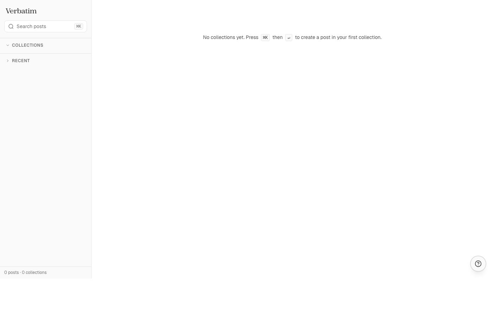

# Verbatim 1.0

> Local-first writing tool. Single-tenant, web-only. Built to replace the Payload admin on Ghaith's blog. Drives 200+ posts in three collections.

**Live:** [verbatim-rho.vercel.app](https://verbatim-rho.vercel.app) · **Spec:** [PRD.md](PRD.md)



---

## What it is

A focused, keyboard-first writing app. Every edit lands in IndexedDB first, then syncs to Supabase on idle. The editor never reaches over the network on a keystroke. Posts are grouped into **collections** that you author like Figma project tabs: a name, an emoji, and a description, with a per-collection running id you use as the slug (`HKM·01`, `JRN·47`).

The blog (a separate Next.js + Payload project) reads the same Supabase rows — Verbatim is purely the writing surface.

## Features

- **Local-first editor** — Dexie/IndexedDB is the source of truth; ~100 ms keystroke→save, 2 s idle→push, realtime pulls.
- **BlockNote** with Markdown round-trip, image upload to Supabase Storage, and a custom `[[wikilink]]` autocomplete.
- **Collections** as first-class entities (`name`, `emoji`, `description`, `position`). Renaming cascades to every post (`posts.type` + slug rewrite).
- **Sequential post IDs** scoped to the collection: first 3 consonants of the name, dot, zero-padded seq → `HKM·01..HKM·99`.
- **Command palette** (`⌘K`) with subsequence-fuzzy command mode (`/`), default new-post shortcut, and contextual search.
- **Sidebar** with global search, expandable collection folders, and a virtualized Recent list.
- **Version history** — snapshots on publish / manual (`⌘⇧S`) / revert, with side-by-side diff and one-click revert.
- **Light / dark theme** (`⌘⇧L`), persisted; defaults to system preference.
- **Author mode** (`⌘\`) — hides chrome for full-screen writing.
- **PWA** with service-worker shell caching and a manifest.
- **Realtime sync** subscribes to posts, versions, and collections so MCP/CLI edits show up immediately.

## Keyboard

| Shortcut | Action |
| --- | --- |
| `⌘K` | Command palette (search posts / type `/` for commands) |
| `⌘⇧N` | New post in the current/last collection |
| `⌘⇧S` | Snapshot version |
| `⌘⇧L` | Toggle light/dark theme |
| `⌘\` | Toggle author mode |
| `[[` | Wikilink autocomplete (inside editor) |
| `↑` / `↓` | Prev / next post within the collection (editor header) |
| `esc` | Close palette/dialog |

## Architecture

```
┌──────────────────────────────────────────────────────────┐
│  Verbatim app — Vite + React 19 + TS + Tailwind v4       │
│   ├─ BlockNote editor (Markdown round-trip)              │
│   ├─ Untitled UI primitives (ported from Genesis)        │
│   ├─ react-aria-components for menus / dialogs / inputs  │
│   ├─ MiniSearch in-memory index (rebuilt on change)      │
│   ├─ cmdk command palette                                │
│   └─ Dexie (IndexedDB) — `posts`, `versions`, …          │
└─────────────────────┬────────────────────────────────────┘
                      │ supabase-js (postgrest + realtime + storage)
                      ▼
┌──────────────────────────────────────────────────────────┐
│  Supabase project `REDACTED_PROJECT_REF`                 │
│   ├─ public.posts          (Payload-managed + content_md │
│   │                         + collection_seq + favorited)│
│   ├─ public.collections    (name PK, emoji, description) │
│   ├─ public.post_versions  (append-only history)         │
│   └─ storage.verbatim/     (image uploads, public-read)  │
└──────────────────────────────────────────────────────────┘
```

### Sync engine

Ported from [Anderson](https://github.com/Ghaith-Ayadi/Anderson)'s `src/lib/sync.ts`:

| Trigger | What runs | Latency target |
| --- | --- | --- |
| Keystroke | local Dexie put | sub-ms |
| 2 s idle | push dirty rows to Supabase | <500 ms |
| Window blur / `beforeunload` | force flush | within ms |
| Window focus / channel reconnect | pull `updated_at > cursor` | <1 s |

Conflict policy: last-write-wins by server clock unless the local row is `dirty` with a newer `updatedAt` than the inbound row.

## Repo layout

```
.
├── app/             Vite editor app
│   └── src/
│       ├── components/      UI (Editor, Sidebar, CommandPalette, …)
│       ├── components/base/ Untitled UI primitives (Input, Select, Button, …)
│       ├── lib/             db, supabase, sync, realtime, search, theme,
│       │                    collections, postId, format, route, …
│       ├── styles/          Genesis theme + globals + typography
│       └── App.tsx
├── scripts/         Node scripts (pg + dotenv, no bun/supabase CLI required)
│   ├── sql/         Numbered migrations applied via src/migrate.ts
│   └── src/         migrate.ts, lexical-to-markdown.ts, init-slugs.ts, …
├── mcp-server/      Phase 1.4 placeholder — empty
├── docs/            README assets
└── PRD.md
```

## Data model

The Supabase schema started as a Payload-managed blog DB. Verbatim extended it through six numbered migrations (under `scripts/sql/`):

| # | Migration | Adds / changes |
| --- | --- | --- |
| 0001 | `init` | `posts.content_md`, `posts.favorited`, `posts.updated_at` trigger, `post_versions` table, realtime publication |
| 0002 | `storage` | `storage.buckets` row `verbatim` + RLS for image uploads |
| 0003 | `type_is_collection` | Drop the early `collections` join table; convert `posts.type` enum → text |
| 0004 | `collection_meta` | (Color-only metadata; superseded by 0005 — dropped there) |
| 0005 | `collections` | Real `collections` table: `name` PK, `emoji`, `description`, `position`. Backfilled one row per distinct `posts.type` |
| 0006 | `collection_seq` | `posts.collection_seq` int; backfilled by id-order within collection |

The Lexical→Markdown migration (`scripts/src/lexical-to-markdown.ts`) walked the 217 legacy Payload Lexical trees once. The `scripts/src/init-slugs.ts` one-shot rewrote every slug into the `{PREFIX}·{NN}` scheme and renumbered `collection_seq` to leave no gaps.

## Setup

```sh
cp .env.example .env.local
# Fill in SUPABASE_DB_PASSWORD (for scripts/) and SUPABASE_SERVICE_ROLE_KEY
# (for the future MCP server). VITE_SUPABASE_URL +
# VITE_SUPABASE_PUBLISHABLE_KEY ship in the example.
```

### Scripts

```sh
cd scripts
npm install
npm run migrate           # apply every scripts/sql/*.sql in order
npm run lexical-to-md     # one-time Lexical→Markdown converter
node --experimental-strip-types src/init-slugs.ts  # rewrite slugs + seq
```

The migration runner probes Supabase pooler regions until it finds the project's (saves us from needing the Supabase CLI). Applied migrations are tracked in `public._verbatim_migrations`.

### App

```sh
cd app
npm install
npm run dev               # http://localhost:5173
npm run build
npm run typecheck
```

Deployed via the Vercel CLI from the repo root — `vercel.json` builds `app/` and serves `app/dist`. Production env vars (`VITE_SUPABASE_URL`, `VITE_SUPABASE_PUBLISHABLE_KEY`) are set in the Vercel project.

## Decisions worth noting

- **TanStack Router not used** — the PRD called for it, but at two views (`#/` and `#/post/:id`) it would have been ceremony. Replaced with a tiny `useRoute` hook on `location.hash`.
- **Routing by post id, not slug** — slugs are mutable (renaming a collection cascades; users can edit by hand). Routes use the immutable integer id; slug is purely a label for blog URLs.
- **Auth bypassed for v1** — the Supabase Auth + Resend SMTP path is wired in code (`lib/auth.ts`, OTP UI in `AuthGate`) but the gate is currently a passthrough while Resend domain verification is sorted out. Single-tenant so the publishable key is sufficient.
- **Versions written client-side** — no database trigger. Snapshots happen on publish transition, manual `⌘⇧S`, and pre-revert. Realtime subscribes to `post_versions` so MCP-originated snapshots will surface live in Phase 1.4.
- **No color picker for collections** — earlier iteration used hashed Tailwind 500s; replaced by a single editable emoji per collection. Simpler, more legible.

## Roadmap

### Done (Phase 1.0–1.3 + extras)

- Schema migration, Lexical→Markdown conversion of 217 posts
- BlockNote + Dexie + Supabase sync + realtime
- Command palette, virtualized sidebar, post search
- Author mode, image upload, wikilinks, PWA
- Version history, side-by-side diff, revert
- Collections as first-class entities with rename cascade
- Per-collection sequential post IDs (`HKM·01`)
- Light/dark theme toggle
- Help FAB with cheat sheet
- Geist body + Geist Mono dates + Zodiak titles

### Deferred

- **MCP server (Phase 1.4)** — `mcp-server/` is scaffolded but empty. Will expose `list_posts`, `get_post`, `create_post`, `update_post`, `publish`, `list_versions`, `revert`, `search` over stdio for Claude Code.
- **Public site rewrite** — the existing Payload + Next.js blog still reads from Supabase. Phase 1.5 swaps it to render `content_md` via `react-markdown` + `remark-gfm` and drops the Lexical dependency.
- **Post-list table with status filters** — current home view is a simple per-collection list. Genesis's full Table + filter chips port still pending.

## License

Personal IP. © Ghaith Ayadi.
